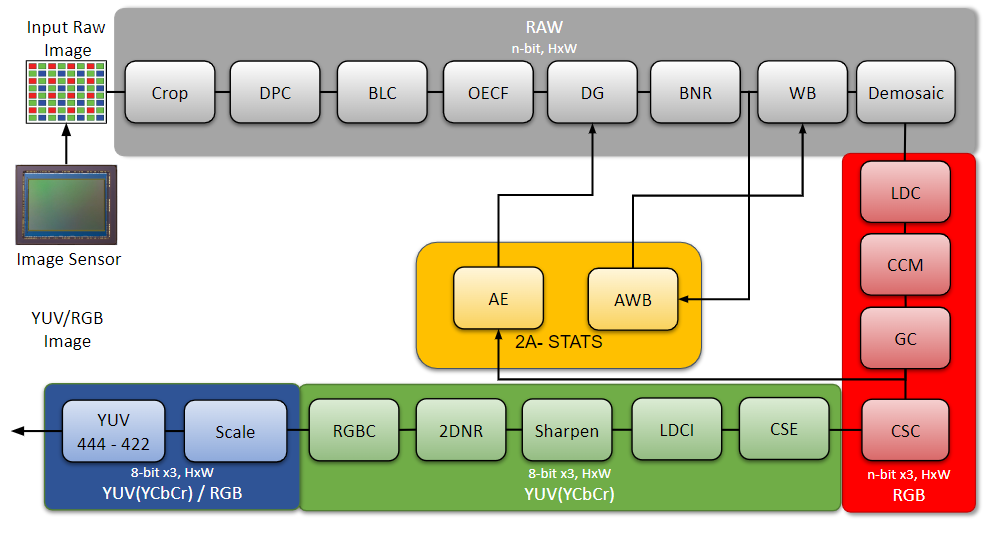

# Infinite-ISP
Infinite-ISP is a full-stack ISP development platform - from algorithm development to RTL design, FPGA/ASIC implementation, and associated firmware, tools, etc. It offers a unified platform that empowers ISP developers to accelerate ISP innovation. It includes a complete collection of camera pipeline modules written in Python, an FPGA bitstream & the associated Firmware for the implementation of the pipeline on the Kria KV260 development board, and lastly, a stand-alone Python-based Tuning Tool application for the pipeline. The main components of the Infinite-ISP project are listed below:

| Repository name        | Description      | 
| -------------  | ------------- |
| **[Infinite-ISP_AlgorithmDesign](https://github.com/10x-Engineers/Infinite-ISP)** :anchor:                    | Python based model of the Infinite-ISP pipeline for algorithm development |
| **[Infinite-ISP_ReferenceModel](https://github.com/10x-Engineers/Infinite-ISP_ReferenceModel)**                      | Python based fixed-point model of the Infinite-ISP pipeline for hardware implementation |
| **[Infinite-ISP_FPGABinaries](https://github.com/10x-Engineers/Infinite-ISP_FPGABinaries)**                                      |FPGA binaries (bitstream + firmware executable) for the Xilinx® Kria KV260’s XCK26 Zynq UltraScale + MPSoC|
| **[Infinite-ISP_Firmware](https://github.com/10x-Engineers/Infinite-ISP_Firmware)**                                      | Firmware for the Kria kV260’s embedded Arm® Cortex®A53 processor|
| **[Infinite-ISP_TuningTool](https://github.com/10x-Engineers/Infinite-ISP_TuningTool)**                              | Collection of calibration and analysis tools for the Infinite-ISP |


# Infinite-ISP Algorithm Design: A Python-based Model for ISP Algorithm Development
Infinite-ISP Algorithm Design is a collections of camera pipeline modules implemented at the application level for converting an input RAW image from a sensor to an output RGB image. Infinite-isp aims to contain simple to complex algorithms at each modular level.




ISP pipeline for `Infinite-ISP v1.1`

## Objectives
Many open-source ISPs are available over the internet. Most of them are developed by individual contributors, each having its strengths. This project aims to centralize all the open-source ISP development to a single place enabling all the ISP developers to have a single platform to contribute. InfiniteISP will not only contain the conventional algorithms but aims to contain state-of-the-art deep learning algorithms as well, enabling a clean comparison between the two. This project has no bounds to ideas and is aimed to include any algorithm that improves the overall results of the pipeline regardless of their complexity.


## Feature Comparison Matrix

A comparison of features with the famous openISP. 

InfiniteISP also tries to simulate the **3A-Algorithms**.

| Modules        | infiniteISP  | openISP        | 
| -------------  | ------------- |  ------------- |          
| Crop                                          | Bayer pattern safe cropping    | ---- |
| Dead Pixel Correction                         | Modified  [Yongji's et al, Dynamic Defective Pixel Correction for Image Sensor](https://ieeexplore.ieee.org/document/9194921) | Yes |
| Black Level Correction                        | Calibration / sensor dependent <br> - Applies BLC from config   | Yes |
| Optical Electronic Transfer Function (OECF)   | Calibration / sensor dependent <br> - Implements a LUT from config | ---- |
| Anti Aliasing Filter                          | ----  | Yes |
| Digital Gain                                  | Gains from config file | Brightness contrast control |
| Lens Shading Correction                       | To Be Implemented  | ---- |
| Bayer Noise Reduction                         | [Green Channel Guiding Denoising by Tan et al](https://www.researchgate.net/publication/261753644_Green_Channel_Guiding_Denoising_on_Bayer_Image)  | Chroma noise filtering |
| White Balance                                 | WB gains from config file  | Yes |
| CFA Interpolation                             | [Malwar He Cutler’s](https://www.ipol.im/pub/art/2011/g_mhcd/article.pdf ) demosaicing algo  | Yes <br> - Malvar He Cutler|
| **3A - Algorithms**                           | **AE & AWB** | ---- |
| Auto White Balance                            | - [Grey World](https://www.sciencedirect.com/science/article/abs/pii/0016003280900587) <br> - [Norm 2](https://library.imaging.org/admin/apis/public/api/ist/website/downloadArticle/cic/12/1/art00008) <br> - [PCA algorithm](https://opg.optica.org/josaa/viewmedia.cfm?uri=josaa-31-5-1049&seq=0) | ---- |
| Auto Exposure                                 | - [Auto Exposure](https://www.atlantis-press.com/article/25875811.pdf) based on skewness | ---- |
| Color Correction Matrix                       | Calibration / sensor dependent <br> - 3x3 CCM from config  | Yes <br> - 4x3 CCM  |
| Gamma Tone Mapping                            | Gamma LUT in RGB from config file  | Yes <br> - YUV and RGB domain|
| Color Space Conversion                        | YCbCr digital <br> - BT 601 <br> - Bt 709  <br>   | Yes <br> - YUV analogue |
| Contrast Enhancement                          | Modified [contrast limited adaptive histogram equalization](https://arxiv.org/ftp/arxiv/papers/2108/2108.12818.pdf#:~:text=The%20technique%20to%20equalize%20the,a%20linear%20trend%20(CDF))  | ---- |
| Edge Enhancement / Sharpeining                | Simple unsharp masking with strength control | Yes | 
| Noise Reduction                               | [Non-local means filter](https://www.ipol.im/pub/art/2011/bcm_nlm/article.pdf) | Yes <br> - NLM filter <br> - Bilateral noise filter|
| Hue Saturation Control                        | ---- | Yes |
|RGB Conversion| Apply inverse conversion from YUV to RGB - same standard as CSC| No|
| Scale                                         | - Integer Scaling  <br> - Non-Integer Scaling | ---- |
| False Color Suppression                       | ---- | Yes |      
| YUV Format                                    | - YUV - 444 <br> - YUV - 422 <br>  | ---- |


## Dependencies
The project is compatible with `Python_3.9.12`

The dependencies are listed in the [requirements.txt](requirements.txt) file. 

The project assumes pip package manager as a pre-requisite.

## How to Run
Follow the following steps to run the pipeline
1.  Clone the repo using 
```shell
git clone https://github.com/10xEngineersTech/Infinite-ISP_ReferenceModel
```

2.  Install all the requirements from the requirements file by running
```shell
pip install -r requirements.txt
```
3. Run [isp_pipeline.py](isp+pipeline.py) 
```shell
python isp_pipeline.py
```

### Example

There are a few sample images with tuned configurations already added to the project at [in_frames/normal](in_frames/normal) folder. In order to run any of these, just replace the config file name with any one of the sample configurations provided. For example to run the pipeline on `Indoor1_2592x1536_12bit_RGGB.raw` simply replace the config file name and data path in [isp_pipeline.py](isp_pipeline.py) 

```python
CONFIG_PATH = './config/Indoor1_2592x1536_12bit_RGGB-configs.yml'
RAW_DATA = './in_frames/normal/data'
```

## How to Run on Pipeline on Multiple Images/Dataset

There is another script [isp_pipeline_multiple_images.py](isp_pipeline_multiple_images.py) that runs Infinite-ISP on multiple images with two modes:


1. DATASET PROCESSING
    <br >Execute multiple images. Raw image should have its own config file with name `<filename>-configs.yml` where `<filename>` is raw filename otherwise the default configuration file [configs.yml](config/configs.yml) is used.

    For raw image format such as, NEF, DNG and CR2 we have also provided a funcationality to extract sensor information provided in these raw files metadata and update default config file.

2. VIDEO MODE
   <br> Each image in the dataset is considered as video frame in sequence. All images use the same configuration parameters from [configs.yml](config/configs.yml) and 3A Stats calculated on a frame are applied to the next frame.

After cloning the repository and installing all the dependencies follow the following steps:

1.  Set `DATASET_PATH` to dataset folder. For example if images are in in [in_frames/normal/data](in_frames/normal/data) folder
```python
DATASET_PATH = './in_frames/normal/data'
```

2. If your dataset is present on another git repository you can use it as a submodule by using the following commands in the root directory. In the command, `<url>` is the address of git repository such as `https://github.com/<user>/<repository_name` and `<path>` is the location in your repository where you want to add the submodule and for Infinite ISP `<path>` should be `./in_frames/normal/<dataset_name>`. Please keep in mind that your `<dataset_name>` should not be `data` because directory [in_frames/normal/data](in_frames/normal/data) already exists.

```shell
git submodule add <url> <path>
git submodule update --init --recursive
``` 


4. After adding git repository as a submodule update `DATASET_PATH` variable in [isp_pipeline_dataset.py](isp_pipeline_dataset.py) to `./in_frames/normal/<dataset_name>`. Git does not allow to import a repository’s subfolder using a submodule. You can only add an entire repository and then access the folder. If you want to use images from a subfolder of a submodule modify the `DATASET_PATH` variable in [isp_pipeline_dataset.py](isp_pipeline_dataset.py)  or [video_processing.py](video_processing.py)  accordingly.

```python
DATASET_PATH = './in_frames/normal/<dataset_name>'
```

5. Run `isp_pipeline_dataset.py` or `video_processing.py`
6. The processed images are saved in [out_frames](out_frames/) folder.

## Test Vector Generation
Please refer to  the provided [instructions](test_vector_generation/README.md) for generating test vectors for multiple images, considering individual or multiple modules as the Device Under Test (DUT).

## Contributing

Please read the [Contribution Guidelines](docs/CONTRIBUTIONS.md) before making a Pull Request

## Results
Here are the results of this pipeline compared with a market competitive ISP. 
The outputs of our ISP are displayed on the right, with the underlying ground truths on the left.


&emsp;&emsp;&emsp;&emsp;&emsp;&emsp;&emsp;&emsp;&emsp;&emsp; **ground truths**     &emsp;&emsp;&emsp;&emsp;&emsp;&emsp;&emsp;&emsp;&emsp;&emsp;&emsp;&emsp;&emsp;&emsp;&emsp;&emsp;&emsp;&emsp;&emsp;&emsp;&emsp;&emsp;&emsp;&emsp;&emsp;&emsp; **infiniteISP** 


A comparison of the above results based on PSNR and SSIM image quality metrics

| Images    | PSNR  | SSIM  |
|-----------|-------|-------|
| Indoor1   |20.0974     |0.8599
|Outdoor1   |21.8669     |0.9277
|Outdoor2   |20.3430     |0.8384
|Outdoor3   |19.3627     |0.8027 
|Outdoor4   |20.7741     |0.8561

## User Guide

You can run the project by simply executing the [isp_pipeline.py](isp_pipeline.py). This is the main file that loads all the algorithic parameters from the [configs.yml](config/configs.yml)
The config file contains tags for each module implemented in the pipeline. A brief description as well as usage of each module is as follows:

### Platform

| platform            | Details | 
| -----------         | --- |
| filename            | Specifies the file name for running the pipeline. The file should be placed in the [in_frames/normal](in_frames/normal) directory 
| disable_progress_bar| Enables or disables the progress bar for time taking modules
| leave_pbar_string   |  Hides or unhides the progress bar upon completion

### Sensor_info

| sensor Info   | Details | 
| -----------   | --- |
| bayer_pattern | Specifies the bayer patter of the RAW image in lowercase letters <br> - `bggr` <br> - `rgbg` <br> - `rggb` <br> - `grbg`|
| range         | Not used |
| bit_depth        | The bit depth of the raw image |
| width         | The width of the input raw image |
| height        | The height of the input raw image |
| hdr           | Not used |

### Crop

| crop          | Details | 
| -----------   | --- |
| is_enable      |  Enables or disables this module. When enabled it ony crops if bayer pattern is not disturbed
| is_debug       |  Flag to output module debug logs 
| new_width     |  New width of the input RAW image after cropping
| new_height    |  New height of the input RAW image after cropping

### Dead Pixel Correction 

| dead_pixel_correction | Details |
| -----------           |   ---   |
| is_enable              |  Enables or disables this module
| is_debug               |  Flag to output module debug logs 
| dp_threshold          |  The threshold for tuning the dpc module. The lower the threshold more are the chances of pixels being detected as dead and hence corrected  

### HDR Stitching 

To be implemented

### Black Level Correction 

| black_level_correction  | Details |
| -----------             |   ---   |
| is_enable                |  Enables or disables this module
| r_offset                |  Red channel offset
| gr_offset               |  Gr channel offset
| gb_offset               |  Gb channel offset
| b_offset                |  Blue channel offset
| is_linear                |  Enables or disables linearization. When enabled the BLC offset maps to zero and saturation maps to the highest possible bit range given by  the user  
| r_sat                   | Red channel saturation level  
| gr_sat                  |  Gr channel saturation level
| gb_sat                  |  Gb channel saturation level
| b_sat                   |  Blue channel saturation level

### Opto-Electronic Conversion Function 

| OECF  | Details |
| -----------     |   ---   |
| is_enable        | Enables or disables this module
| r_lut           | The look up table for oecf curve. This curve is mostly sensor dependent and is found by calibration using some standard technique 

### Digital Gain

| digital_gain    | Details |
| -----------     |   ---   |
| is_enable        | This is a essential module and cannot be disabled 
| is_debug         | Flag to output module debug logs
| gain_array      | Gains array. User can select any one of the gain listed here. This module works together with AE module  |
| current_gain    | Index for the current gain starting from zero |

### Lens Shading Calibration 

To be implemented

### Bayer Noise Reduction

| bayer_noise_reduction   | Details |
| -----------             |   ---   |
| is_enable                | When enabled reduces the noise in bayer domain using the user given parameters |
| filt_window             | Should be an odd window size
| r_std_dev_s               | Red channel gaussian kernel strength. The more the strength the more the blurring. Cannot be zero  
| r_std_dev_r               | Red channel range kernel strength. The more the strength the more the edges are preserved. Cannot be zero
| g_std_dev_s               | Gr and Gb gaussian kernel strength
| g_std_dev_r               | Gr and Gb range kernel strength
| b_std_dev_s               | Blue channel gaussian kernel strength
| b_std_dev_r               | Blue channel range kernel strength


### White balance

| white_balance           | Details |
| -----------             |   ---   |
| is_enable                | Applies user given white balance gains when enabled |
| is_auto                  | When true enables the 3A - AWB and does not use the user given WB gains |
| r_gain                  | Red channel gain  |
| b_gain                  | Blue channel gain |

<!-- ### CFA Interpolation (Demosaicing)

| demosaic                | Details |
| -----------             |   ---   |
| is_enable                | This is a essential module and cannot be disabled | --> -->

### 3A - Auto White Balance (AWB)
| auto_white_balance      | Details |
| -----------             |   ---   |
| is_debug         | Flag to output module debug logs|
| underexposed_pecentage   | Set % of dark pixels to exclude before AWB gain calculation|
| overexposed_pecentage    | Set % of saturated pixels to exclude before AWB gain calculation|
| algorithm               | Can select one of the following algos <br> - `grey_world`  <br> - `norm_2`  <br> - `pca` |
| percentage              | [0 - 100] - Parameter to select dark-light pixels percentage for pca algorithm |

### Color Correction Matrix (CCM)

| color_correction_matrix                 | Details |
| -----------                             |   ---   |
| is_enable                                | When enabled applies the user given 3x3 CCM to the 3D RGB image having rows sum to 1 convention  |
| corrected_red                           | Row 1 of CCM
| corrected_green                         | Row 2 of CCM
| corrected_blue                          | Row 3 of CCM

### Gamma Correction
| gamma_correction        | Details |
| -----------             |   ---   |
| is_enable                | When enabled  applies tone mapping gamma using the LUT  |
| gamma_lut_8                | The look up table for 8-bit gamma curve |
| gamma_lut_10                | The look up table for 10-bit gamma curve |
| gamma_lut_12               | The look up table for 12-bit gamma curve |
| gamma_lut_14              | The look up table for 14-bit gamma curve |

### 3A - Auto Exposure
| auto_exposure      | Details                                                                                      
|--------------------|----------------------------------------------------------------------------------------------|
| is_enable           | When enabled applies the 3A- Auto Exposure algorithm                                         |
| is_debug            | Flag to output module debug logs                                                             |  
| center_illuminance | The value of center illuminance for skewness calculation ranges from 0 to 255. Default is 90 |   
| histogram_skewness | The range of histogram skewness should be between 0 and 1 for correct exposure calculation   |  

### Color Space Conversion (CSC)

| color_space_conversion | Details                                                                             |  
|------------------------|-------------------------------------------------------------------------------------|
| is_enable               | This is a essential module and cannot be disabled                                   |   
| conv_standard          | The standard to be used for conversion <br> - `1` : Bt.709 HD <br> - `2` : Bt.601/407 |   

### Contrast Enchancement 

| ldci       | Details                                                                      | 
|------------|----------------------------------------------------------------------------- |
| is_enable   | When enabled local dynamic contrast enhancement is applied to the Y channel  |  
| clip_limit | The clipping limit that controls amount of detail to be enhanced             |   
| wind       | Window size for applying filter                                              |   

### Edge Enchancement / Sharpening 

| Sharpening         | Details                                           | 
|--------------------|---------------------------------------------------|
| is_enable           | When enabled applies the sharpening | 
| sharpen_sigma      | Define the Standard Deviation of the Gaussian Filter |   
| sharpen_strength   | Controls the sharpen strength applied on the high frequency components  |  


### 2d Noise Reduction

| 2d_noise_reduction | Details                                           | 
|--------------------|---------------------------------------------------|
| is_enable           | When enabled applies the 2D noise reduction | 
| algorithm          | Can select one of the following algos  <br> - `nlm`  <br> - `ebf` |   
| window_size        | Search window size for applying non-local means   |   
| patch_size         | Patch size for applying mean filter               |  
| wts                | Smoothening strength parameter                    | 
| wind               | Window size for applying entropy based bilateral filter           |  
| sigma              | Range and spatial kernel parameter for entropy based bilateral filter                            |

### Scaling 

| scale            | Details |   
|------------------|---------------------------------------------------------------------------------------------------------------------------------------------------
| is_enable         | When enabled down scales the input image                                                                                                 
| is_debug          | Flag to output module debug logs                                                                                                           
| new_width        | Down scaled width of the output image                                                                                                      
| new_height       | Down scaled height of the output image                                                                                                       
| is_hardware       | When true applies the hardware friendly techniques for downscaling. This can only be applied to any one of the input sizes 3 input sizes and can downscale to <br> - `2592x1944` to `1920x1080` or `1280x960` or `1280x720` or `640x480` or `640x360`  <br> - `2592x1536` to `1280x720` or `640x480` or `640x360` <br> - `1920x1080` to to `1280x720` or `640x480` or `640x360`  |  
| algorithm             | Software friendly scaling. Only used when isHardware is disabled <br> - `Nearest_Neighbor` <br> - `Bilinear`                                       
| upscale_method   | Used only when isHardware enabled. Upscaling method, can be one of the above algos                                                          
| downscale_method | Used only when isHardware enabled. Downscaling method, can be one of the above algos 

### YUV Format 
| yuv_conversion_format     | Details                                                |
|---------------------------|--------------------------------------------------------|
| is_enable                  | Enables or disables this module                        |   
| conv_type                 | Can convert the YCbCr to YUV <br> - `444` <br> - `422` |  


## FAQ
**Why is it named infiniteISP?**

ISPs are hardware dependent. In them algorithms are limited to perform to their best because of hardware limitations. InfiniteISP tends to somewhat remove this limitation and let the algorithms perform to the full potential targeting best results. 

**Will inifniteISP also contain algorithms that involve machine learning?**

Yes definitely this is mainly because it is seen that machine learning models tend to give perform much better results as compared to conventional models. The plan is as follows

- The release `v0.x` till `v1.0` will involve buildng a basic ISP pipelne at conventional level. 

- The release `v1.0` will have all camera pipeline modules implemented at conventional level. **This release will mostly contain algorithms that can be easily ported to hardware ISPs** 

- `v1.x.x` releases will have all the necessary improvements of these conventional algorithms till release `v2.0`

- From release `v2.0` infiniteISP will start implementing machine learning models for specific algorithms. 

- Release `v3.0` will have infiniteISP having both conventional and deep learning algorithms (not for all pipeline modules but for specific ones)

## License 
This project is licensed under Apache 2.0 (see [LICENSE](LICENSE) file).

## Acknowledgments
- This project started of from the inspiration of [cruxopen/openISP](https://github.com/cruxopen/openISP.git)

## List of Open Source ISPs
- [openISP](https://github.com/cruxopen/openISP.git)
- [Fast Open Image Signal Processor](https://github.com/QiuJueqin/fast-openISP.git)
- [AbdoKamel - simple-camera-pipeline](https://github.com/AbdoKamel/simple-camera-pipeline.git)
- [Mushfiqulalam - isp](https://github.com/mushfiqulalam/isp)
- [Karaimer - A Software Platform for Manipulating the Camera Imaging Pipeline](https://karaimer.github.io/camera-pipeline)
- [rawpy](https://github.com/letmaik/rawpy.git)
